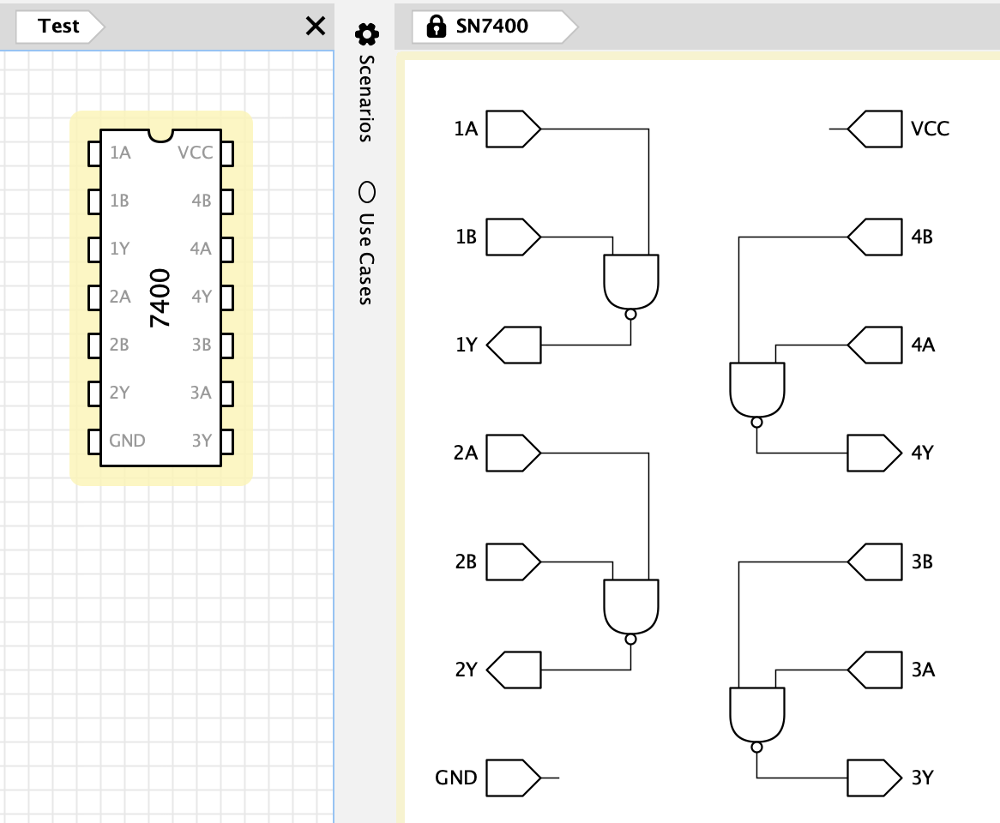

# SN 74xx

[Library File](https://github.com/flandreas/antares-assets/blob/main/libraries/SN74xx/SN74xx.acl)

## Gates

| Chip | Description                  |
|------|------------------------------|
| 7400 | Quadruple 2-Input NAND Gates |
| 7402 | Quadruple 2-Input NOR Gates  |
| 7404 | Hex Inverter                 |
| 7408 | Quadruple 2-Input AND Gates  |
| 7410 | Triple 3-Input NAND Gates    |
| 7411 | Triple 3-Input AND Gates     |
| 7420 | Dual 4-Input NAND Gates      |
| 7421 | Dual 4-Input AND Gates       |
| 7427 | Triple 3-Input NOR Gates     |
| 7430 | 8-Input NAND Gate            |
| 7432 | Quadruple 2-Input OR Gates   |
| 7451 | 2 AND-OR-Invert Gates        |

## Flip-Flops and Latches

| Chip | Description                        |
|------|------------------------------------|
| 7473 | Dual JK Flip-Flop with Clear       |
| 7474 | Dual D Flip-Flop with Preset/Clear |
| 7475 | Quad D Latch                       |

## Encoders and Decoders

| Chip  | Description                          |
|-------|--------------------------------------|
| 7442  | 4-Bit BCD to 10-Line Decimal Decoder |
| 74138 | 3-8 Decoder (inverted)               |

## Arithmetic and Counters

| Chip  | Description                                 |
|-------|---------------------------------------------|
| 7485  | 4-Bit Magnitude Comparator                  |
| 74161 | Synchronous 4-Bit counter with direct clear |
| 74181 | 4-Bit ALU                                   |
| 74283 | 4-Bit Binary Full Adder with Fast Carry     |

## Registers

| Chip  | Description                                                 |
|-------|-------------------------------------------------------------|
| 74373 | Octal D-type latches with tri-state output                  |
| 74574 | Octal edge-triggered D-type flip-flop with tri-state output |

## Misc

| Chip  | Description                                 |
|-------|---------------------------------------------|
| 74245 | Octal bus transceiver with tri-state output |
